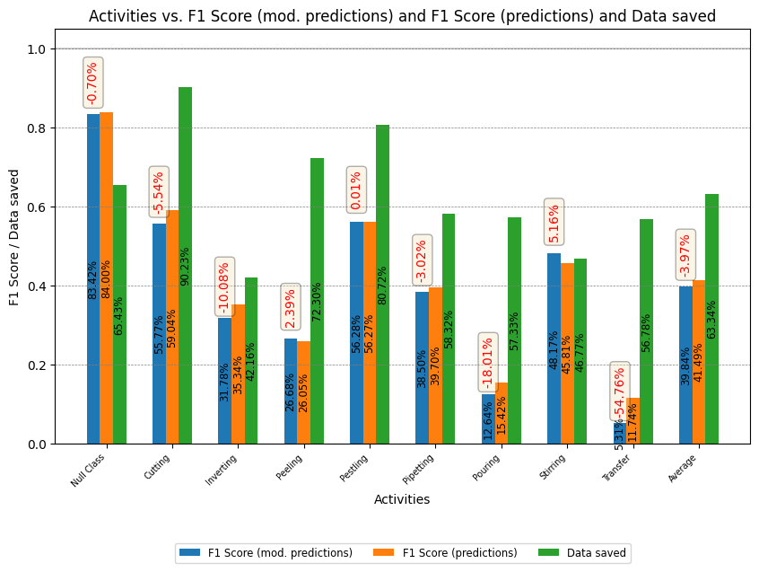
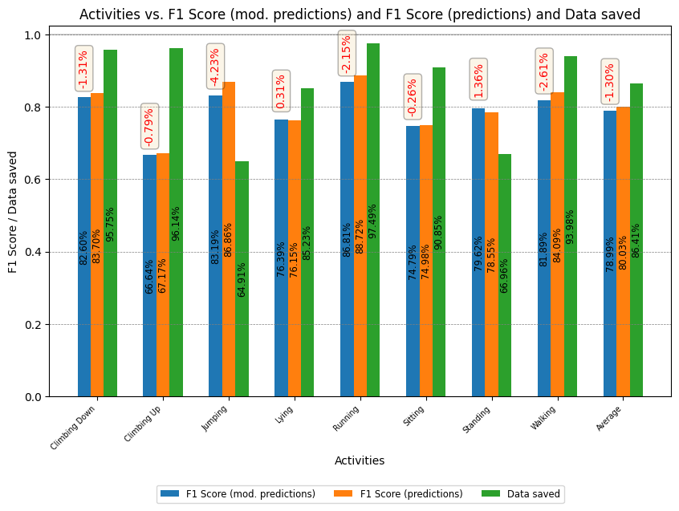
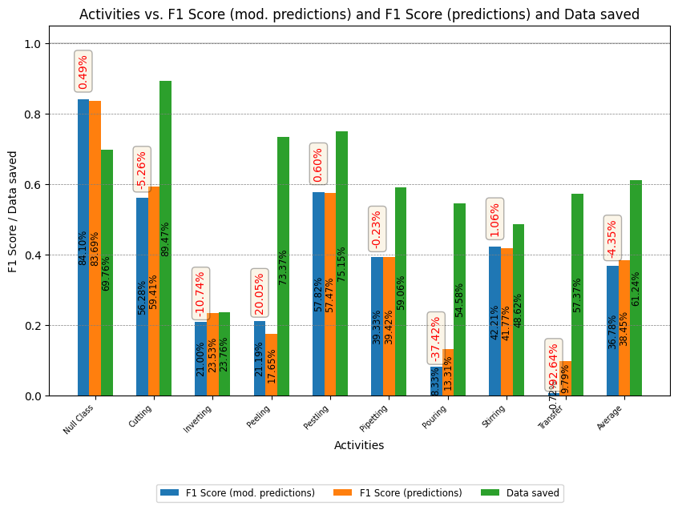

# Reducing Human Activity Data Collection through Machine-Learned Activity-Wise Skips

## Introduction

Human Activity Recognition (HAR) technology is an area of great potential for improving our daily lives. With the increasing use of body wearable devices, people can monitor their fitness levels and avoid health issues. HAR also has the potential to play a major role in detecting and controlling pandemics, as well as diagnosing and monitoring various health issues. HAR has a wide range of applications in industries such as sports, production, logistics, gaming, surveillance, patient monitoring systems, and more. However, HAR devices face challenges due to their small size, limited battery life, and computational and storage capacity. In this thesis, the goal is to optimize the activity prediction process in a way to reduce energy consumption (reduced data collection) while minimizing the impact on the accuracy of the predictions. This repository is still being updated regularly.

## Dataset

The following two datasets were used for the study, the Wetlab dataset and the RWHAR dataset. The Wetlab dataset is publicly available and contains sensor data recorded during a DNA extraction experiment. The data was collected from a 3D accelerometer worn on the wrist of the subjects and includes 8 activities such as cutting, pouring, and stirring, as well as a null class. On the other hand, the RWHAR dataset includes sensor data recorded from 7 on-body positions of 15 subjects who performed 8 different activities such as walking, running, and jumping. The data was recorded in natural settings, including jogging in a forest and climbing stairs in an old castle. Both datasets provide valuable information for developing machine learning algorithms that can recognize human activities. 
The datasets (raw and preprocessed data) used during experiments can be either downloaded via this link:

* Processed datasets: https://uni-siegen.sciebo.de/s/UV0reaerRmcxxYQ

PW: `frontiers22`

Raw dataset links:

* Wetlab: https://uni-siegen.sciebo.de/s/9h2aQbMaOIZsjc3
* RWHAR: https://sensor.informatik.uni-mannheim.de/#dataset_realworld

The processed datasets need to be put in a seperate data directory within the main directory of the repository in order for the main.py script to work. The raw datasets need to be but in a seperate directory data/raw.

### Dataset creation
In order to (re-)create the datasets used within these experiments, please additionally install the modified version of PyAV by Philipp Scholl (https://github.com/pscholl/PyAV).

For Linux:
```
cd data_processing
git clone https://github.com/pscholl/PyAV
sudo apt-get install libx264-dev
sudo apt-get install libavformat-dev
sudo apt-get install libavdevice-dev
cd PyAV
./scripts/build-deps
make
```

Once installed, you can run the `dataset_creation.py` file within the data_processing directory and it will create all relevant datasets and save them to a raw directory within the data directory of this project.


## Requirements
Please install the required python packages as noted in the `requirements.txt`

## Training Pipeline

This thesis proposes a novel method to optimize the duty cycle of sensors through a combination of deep learning and machine learning techniques. By using predictions from a ConvLSTM model to train a machine learning model, the optimized duty cycle is designed to achieve maximum performance metrics while minimizing energy costs. During inference, the trained deep learning model is used to make activity predictions, and the corresponding duty cycle is used to control the on-off switching of the sensors. This optimization is implemented using two popular global-search heuristics algorithms: Simulated Annealing (SA) and Genetic Algorithm (GA). The deep learning training is done through a DeepConvLSTM architecture that outperforms other architectures proposed in the literature. 


## Results

### Simulated Annealing results
The results obtained for the RWHAR and Wetlab datasets are shown below. 




### Genetic Algorithm results
The results obtained for the RWHAR and Wetlab datasets are shown below. 




Repo Structure
* data_processing: contains file for data processing (analysis, creation, preprocessing and sliding window approach)
* model: folder containing the DeepConvLSTM model, train and evaluation script
* SA_model: folder containing the Simulated Annealing training model
* GA_model: folder containing the Genetic Algorithm training model
* skip_heuristics_scripts: folder containing implementation of skipping algorihtm.
* main.py: main script which is to be run in order to commence experiments
* ml_validate: script used to produce validation results. 


## References

[1] Francisco Javier Ordóñez and Daniel Roggen. 2016. Deep Convolutional and LSTM Recurrent Neural Networks for Multimodal Wearable Activity Recognition. Sensors16, 1 (2016). https://doi.org/10.3390/s16010115

[2] Marius Bock, Alexander Hölzemann, Michael Moeller, and Kristof Van Laerhoven. 2021. Improving Deep Learning for HAR with shallow LSTMs. In 2021 International Symposium on Wearable Computers (ISWC ’21), September 21–26, 2021, Virtual, USA. ACM, New York, NY, USA, 6 pages. https://doi.org/10.1145/3460421.3480419

[3] Philipp M. Scholl, Matthias Wille, and Kristof Van Laerhoven. 2015. Wearables in the Wet Lab: A Laboratory System for Capturing and Guiding Experiments. 589–599. https://doi.org/10.1145/2750858.2807547

